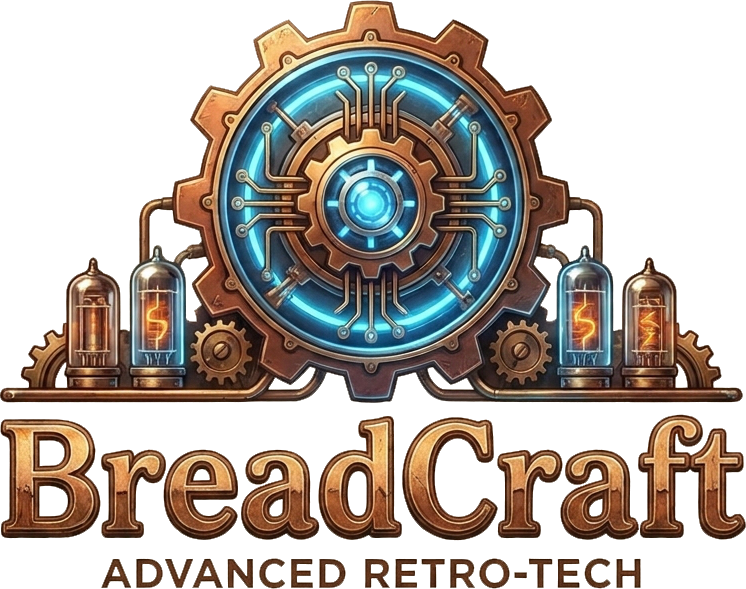
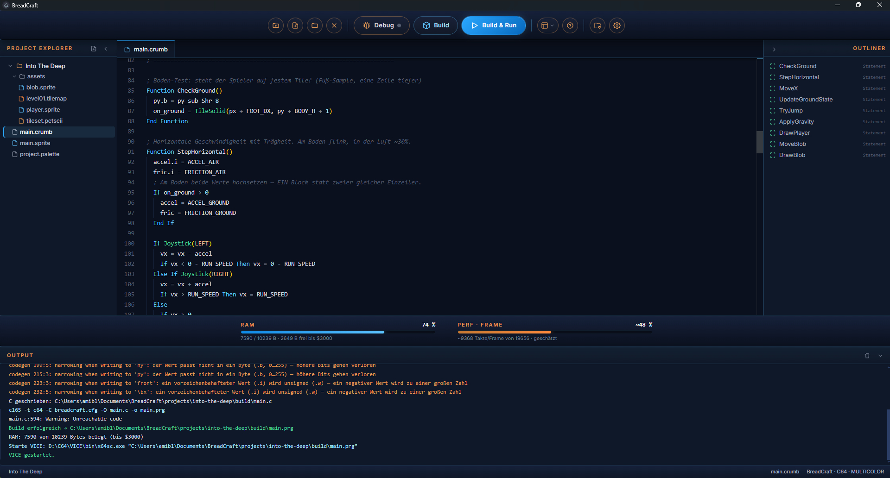
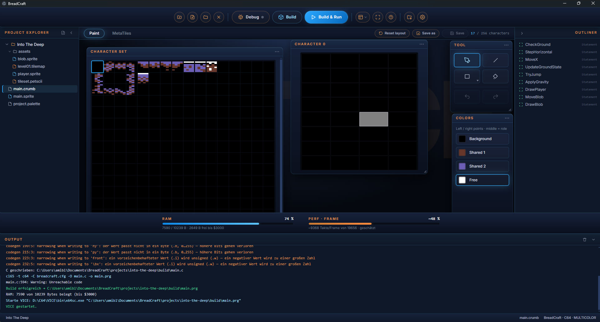
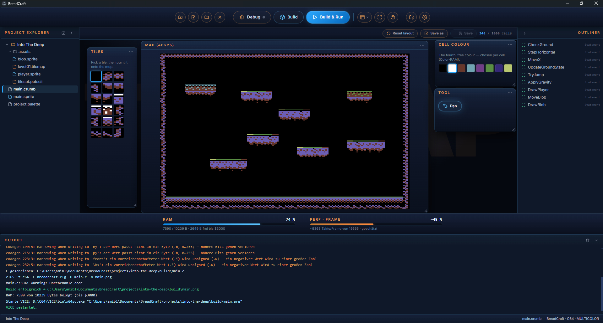
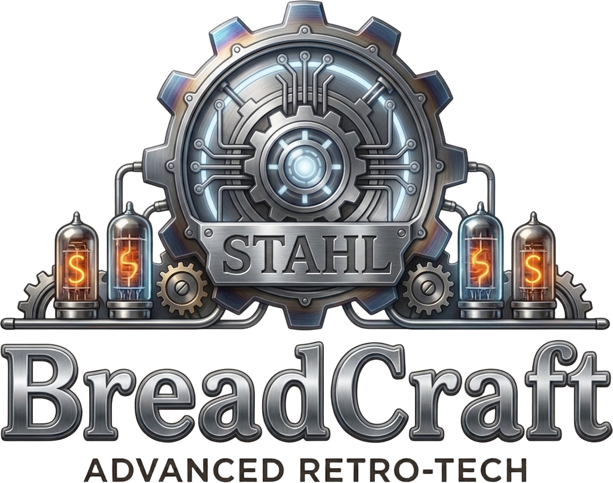

<p align="center">
  
</p>

# BreadCraft

BreadCraft is an experiment in making a small, self-contained IDE for writing
games for the Commodore 64. The idea is simple: you write in a readable
BASIC-like language, and BreadCraft turns that into a real `.prg` that runs on a
C64 (or an emulator). It bundles the compiler, so there is — eventually — nothing
else to install.

It is a work in progress and far from finished. This README tries to describe
honestly what works today and what does not, so nobody arrives expecting more
than is there.

## The idea

The C64 is a lovely machine, but most of its tooling assumes you already know its
hardware. BreadCraft is aimed at people who want to make a C64 game without first
having to learn VIC registers, charset memory layout, or 6502 assembly — while
still being honest about what the hardware actually costs. Where something is
expensive on a 6502 (a multiply, a division in the frame loop, a missing frame
sync), BreadCraft tries to say so rather than hide it.

The language is called `.crumb`. A project is a `.bread` file. The compiler under
the hood is [cc65](https://cc65.github.io/).

## A look at it

The shots below are the real in-progress test game, a platformer called
*Into The Deep*.



*The `.crumb` code editor. Real platformer code: user functions, joystick reads,
tile collision (`TileSolid`) and signed `.i` physics — with the function outline
on the right and the RAM / per-frame health bars underneath, and a build that
ends in a launched VICE in the console below.*



*The charset (PETSCII) editor. The four colours of a multicolor character —
Background, Shared 1, Shared 2 and the Free per-cell colour — are the project's
shared palette, so tiles and sprites can never drift out of step.*



*The tilemap editor. Paint a 40×25 map from your charset and give each cell its
free multicolor colour (the eight the C64 can actually show as that colour). What
you paint here is what runs on the C64.*

## What works today

- **A working language pipeline:** `.crumb` source → C → bundled cc65 → a real
  `.prg`. A program (multicolor text mode, colours, a frame loop, `For`/`If`/
  `While`, variables) compiles and runs in an emulator.
- **A type system:** byte/word/signed/string suffixes (`.b` / `.w` / `.i` / `$`),
  `Global`, `Const`, fixed-size `Dim` arrays (1D and 2D), records
  (`Type` / `Field` / `EndType`), and user functions
  (`Function` … `EndFunction`). It warns, rather than fails silently, when a word
  value is narrowed into a byte.
- **A tile world:** paint a charset and a 40×25 tilemap — including the free
  per-cell multicolor colour — and bring it on screen from `.crumb`
  (`UseTileset`, `DrawMap`, `SetTile`), then read it back at runtime
  (`GetTile`, `TileAt`, `TileSolid`). What you paint in the editor is what runs
  on the C64. Solidity is a property you mark on the tile itself in the editor
  (it travels with the charset), so collision is about *what a tile is*, not
  about whatever happens to be on the screen.
- **Sprites:** define a sprite, place it, show/hide it (`UseSprite`, `Sprite`,
  `ShowSprite` / `HideSprite`). The fiddly hardware bits (the 9th X bit, the
  shared colour registers) are handled for you.
- **On-screen text and a HUD:** draw text (`DrawText`) in a chosen pen colour
  (`Color`), turn a number into text (`Str$`) and build small strings — enough
  for a score, lives, or a "GAME OVER". (Richer string surgery — `Mid$`,
  `Left$`, … — is honestly deferred, not silently broken.)
- **Joystick input** (`Joystick`).
- **Graphics-mode setup** (`Graphics TEXT, MULTICOLOR`), frame sync (`VWait`),
  and a **PAL / NTSC choice** per project — it sets both the per-frame budget the
  health bar measures against and the region the emulator boots in, instead of
  silently assuming 50 Hz.
- **Editors**, sharing one drawing engine: a project palette, a PETSCII/charset
  editor, a tilemap editor, and a sprite editor. Assets live on disk as
  `.petscii` / `.tilemap` / `.palette` / `.sprite`, referenced from the `.bread`
  manifest; the editor and the build read them through one shared format.
- **Health bars:** live RAM usage (read from the linker map — exact) and a rough
  per-frame cost estimate, so you can feel the budget while you write.
- **German and English UI** — and the compiler's error messages now follow the
  UI language too.

## What does not work yet

This is the honest part.

- **Windows only, for now.** BreadCraft is built and tested on Windows, and the
  cc65 it bundles is the Windows build. macOS and Linux are not supported yet —
  cross-platform support arrives later, hand in hand with a first-run download
  that fetches the toolchain for you. Until then, this is a Windows program.
- **No finished game has been built with it yet.** The goal is that a simple
  platformer (the in-progress test game *Into The Deep*), a Sokoban-style puzzle,
  and a Maniac-Mansion-style adventure can all be built — that bar has not been
  reached.
- **No sound.** There is a placeholder sound editor, but the language has no
  sound commands and the SID is not driven yet.
- **Keyboard input is deferred.** Only the joystick can be read today;
  `KeyDown` / `KeyHit` report an honest "not implemented yet" rather than
  producing broken code.
- **Only `TEXT, MULTICOLOR`.** The language knows the other mode bits
  (`BITMAP`, `HIRES`), but the editors and new projects currently centre on
  multicolor text; the other modes are visible-but-disabled when you create a
  project.
- **More than 8 sprites needs assembly.** There is an `Asm` … `EndAsm` escape
  hatch, but no built-in sprite multiplexer yet.
- **The embedded emulator is not wired up.** To run a `.prg`, BreadCraft
  currently shells out to [VICE](https://vice-emu.sourceforge.io/), which you
  install yourself and point BreadCraft at in the settings.
- Rough edges throughout. Expect things to be missing or to change.

## The refinement ladder

BreadCraft is hardened in named stages — a metal ladder climbed one rung at a
time, from rough to refined. A stage is only reached once the work it stands for
is demonstrably done; only then does development move up to the next. The rungs,
in order, are:

**Rost → Eisen → Stahl → Bronze → Silber → Gold → Platin**

(rust, iron, steel, bronze, silver, gold, platinum). *Rost* is the raw starting
state; *Platin* is the far end, where only polish is left to do.

The stage BreadCraft stands on today:

<p align="center">
  
</p>

<p align="center"><i>Stahl — tempered: the hardware reality underneath now bears a growing game.</i></p>

## Building it

It is an [Electron](https://www.electronjs.org/) app (Vue + TypeScript).
For now it is developed and packaged for **Windows only** — the bundled cc65 is
the Windows build, and the paths have not been exercised on macOS or Linux.

```
npm install
npm run dev      # run in development
npm run test     # run the unit tests
npm run build    # production build
```

To actually run a generated `.prg`, install VICE separately and set its path in
BreadCraft's settings. VICE is not bundled (see Licensing).

## Licensing

BreadCraft is released under the [MIT license](LICENSE) — do with it what you
like.

It bundles the cc65 toolchain (zlib-licensed) under `resources/cc65/`. It does
**not** bundle VICE, which is GPL-3.0 and is used only as a separate, externally
installed program. See [THIRD-PARTY-LICENSES.md](THIRD-PARTY-LICENSES.md) for
details.
